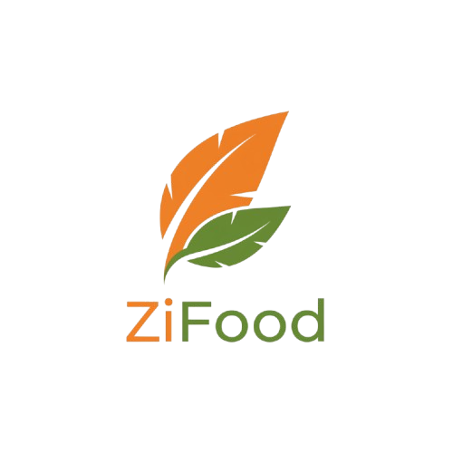

<div align="center">

  

  # 🍽️ ZiFood
  ### *Platform Kuliner & E-Commerce Modern Berbasis Web*

  <p align="center">
    <strong>Menghubungkan Cita Rasa Lokal dengan Kemudahan Transaksi Digital Masa Depan</strong>
  </p>

  <p align="center">
    <a href="https://laravel.com"></a>
    <a href="https://php.net"></a>
    <a href="https://tailwindcss.com"></a>
    <a href="https://alpinejs.dev"></a>
    <a href="https://mysql.com"></a>
    <a href="LICENSE"></a>
  </p>

  <p align="center">
    <a href="#-tentang-zifood"><b>Tentang</b></a> •
    <a href="#-fitur-unggulan"><b>Fitur Unggulan</b></a> •
    <a href="#-teknologi"><b>Teknologi</b></a> •
    <a href="#-alur-pengguna"><b>Alur Sistem</b></a> •
    <a href="#-panduan-instalasi"><b>Instalasi</b></a> •
    <a href="#-struktur-direktori"><b>Struktur Direktori</b></a> •
    <a href="#-kontak--pengembang"><b>Pengembang</b></a>
  </p>

</div>

---

## 📖 Tentang ZiFood

> **ZiFood** hadir sebagai solusi digital untuk mengatasi antrean panjang serta mempermudah transaksi kuliner bagi siswa, civitas, dan pelaku UMKM. 

Mengusung antarmuka modern bernuansa *glassmorphism* yang responsif dan cepat, platform ini mengintegrasikan dua peran utama:
* **👤 Pembeli (Buyer):** Memesan makanan secara instan, memilih opsi *custom order*, melihat estimasi status pesanan secara *real-time*, hingga memberikan ulasan.
* **🏪 Penjual (Seller):** Mengelola etalase menu, memproses alur pesanan yang masuk, melihat rekapan omzet berkala, dan memperkuat reputasi toko kuliner.

---

## ✨ Fitur Unggulan

<table>
<tr>
<td width="50%" valign="top">

### 🛒 Modul Pembeli (Buyer)
* **Smart Marketplace & Explore:** Jelajahi menu andalan dari berbagai toko mitra.
* **Smart Cart & Direct Buy:** Tambah item ke keranjang atau langsung lakukan *Buy Now*.
* **Custom Notes:** Tambahkan catatan pesanan khusus (*misal: tanpa daun bawang, level pedas*).
* **Live Order Tracking:** Lacak status pesanan (`Menunggu` ➔ `Diproses` ➔ `Selesai`).
* **Fitur Re-Order & Pembatalan:** Batalkan pesanan sebelum diproses atau pesan ulang menu favorit dalam 1 klik.
* **Review & Rating:** Berikan rating bintang 1–5 beserta ulasan setelah hidangan dinikmati.

</td>
<td width="50%" valign="top">

### 🏪 Modul Penjual (Seller)
* **Analytics Dashboard:** Pantau total penjualan, ringkasan pesanan aktif, dan performa omzet.
* **Katalog & Stok Real-Time:** Kelola produk (CRUD), upload foto, harga, dan ketersediaan stok.
* **Order Management System:** Konfirmasi pesanan masuk dan ubah status pengerjaan secara bertahap.
* **Laporan Finansial:** Rekapitulasi mutasi saldo dan total transaksi yang telah sukses.
* **Personalisasi Profil Toko:** Kustomisasi banner toko, logo/foto profil, deskripsi, serta nomor kontak.

</td>
</tr>
</table>

### 🔐 Keamanan & Autentikasi
* **Multi-Role Middleware:** Pemisahan otorisasi ketat antara akun Penjual dan Pembeli.
* **Proteksi Penuh:** Enkripsi password menggunakan hashing *Bcrypt* dan pencegahan serangan *CSRF* di setiap formulir transaksi.
* **Lightbox Video Player:** Media presentasi interaktif profil ZiFood di Landing Page.

---

## 🛠️ Teknologi

<div align="center">

| Lapisan | Teknologi | Peran / Deskripsi |
| :--- | :--- | :--- |
| **Backend Core** | **Laravel 12** | Arsitektur MVC modern, routing fleksibel, dan Eloquent ORM |
| **Runtime** | **PHP 8.2+** | Engine server-side berperforma tinggi |
| **Database** | **MySQL / MariaDB** | Penyimpanan basis data relasional yang andal |
| **User Interface** | **Tailwind CSS** | Styling modern, responsif, dan berbasis komponen utilitas |
| **Interaktivitas** | **Alpine.js** | Reaktivitas komponen UI ringan tanpa beban bundle besar |
| **Asset & Icons** | **Font Awesome 6** | Ikonografi vektor yang intuitif |
| **Typography** | **Plus Jakarta Sans** | Standar tipografi modern untuk kenyamanan membaca |

</div>

---

## 👥 Alur Pengguna

```mermaid
graph TD
    A[Landing Page ZiFood] --> B{Pilih Akses}
    B -->|Masuk sebagai Pembeli| C[Dashboard Pembeli]
    B -->|Masuk sebagai Penjual| D[Dashboard Penjual]

    C --> E[Cari Menu & Toko]
    E --> F[Tambah ke Keranjang / Checkout]
    F --> G[Lacak Status Pesanan]
    G --> H[Beri Ulasan & Rating]

    D --> I[Kelola Menu & Stok]
    D --> J[Proses Pesanan Masuk]
    J --> K[Update Status Pesanan]
    D --> L[Cek Saldo & Laporan Keuangan]
